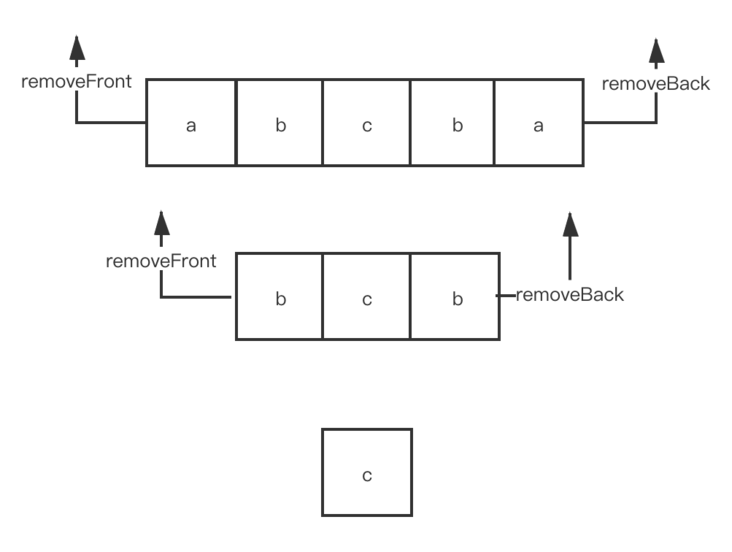

JavaScript数据结构——队列的实现与应用

　　队列与栈不同，它遵从先进先出（FIFO——First In First Out）原则，新添加的元素排在队列的尾部，元素只能从队列头部移除。

```js
function Queue() {
    let items = [];

    // 向队列添加元素（一个或多个）
    this.enqueue = function (item) {
        if (item instanceof Array) items = items.concat(item);
        else items.push(item);
    };

    // 从队列移除元素
    this.dequeue = function () {
        return items.shift();
    };

    // 返回队列中的第一个元素
    this.front = function () {
        return items[0];
    };

    // 判断队列是否为空
    this.isEmpty = function () {
        return items.length === 0;
    };

    // 返回队列的长度
    this.size = function () {
        return items.length;
    };

    // 清空队列
    this.clear = function () {
        items = [];
    };

    // 打印队列内的所有元素
    this.print = function () {
        console.log(items.toString());
    };
}
```
与栈的实现方式类似，唯一不同的是从队列移除元素时取的是队列头部的元素（最先添加的），而栈则是取的顶部元素（最后添加的）。下面是一些测试用例及返回结果：
```js
let queue = new Queue();
console.log(queue.isEmpty()); // true

queue.enqueue('John');
queue.enqueue(['Jack', 'Camila']);
queue.print(); // John,Jack,Camila
console.log(queue.size()); // 3
console.log(queue.isEmpty()); // false
console.log(queue.front()); // John

console.log(queue.dequeue()); // John
queue.print(); // Jack,Camila

queue.clear();
queue.print(); // 
```
注意，我们允许批量向队列中添加元素，为此我们需要判断enqueue方法的参数类型，如果参数是数组，则用concat()函数连接两个数组，如果参数不是数组，则直接用push()函数将元素添加到队列中。

与栈的实现方式一样，这里我们也同样给出用ES6的WeakMap类来实现的队列版本。

```js
let Queue = (function () {
    const items = new WeakMap();

    return class Queue {
        constructor() {
            items.set(this, []);
        }

        enqueue (item) {
            let q = items.get(this);
            if (item instanceof Array) items.set(this, q.concat(item));
            else q.push(item);
        };

        dequeue () {
            let q = items.get(this);
            return q.shift();
        };

        front () {
            return items.get(this)[0];
        };

        isEmpty () {
            return items.get(this).length === 0;
        };

        size () {
            return items.get(this).length;
        };

        clear () {
            items.set(this, []);
        };

        print () {
            console.log(items.get(this).toString());
        };
    }
})();
```
　　这两个版本的执行结果是一样的，它们的区别我们在前一篇文章中已经提及过了，这里不再赘述。

优先队列

　　所谓优先队列，顾名思义，就是说插入到队列中的元素可以根据优先级设置先后顺序。优先级越高位置越靠前，优先级越低位置越靠后。假设优先级用数字来表示，如果数字越小表示的优先级越高，形成的队列就称之为最小优先队列，反之则称之为最大优先队列。下面是实现的代码：
```js
function PriorityQueue() {
    let items = [];

    // 向队列添加元素（一个或多个）
    // 参数obj的数据格式：{element, priority}
    this.enqueue = function (obj) {
        if (obj instanceof Array) {
            for (let i = 0, ci; ci = obj[i]; i++) {
                this.enqueue(ci);
            }
        }
        else {
            let added = false;
            for (let i = 0, ci; ci = items[i]; i++) {
                // 最小优先级，即将priority值小的元素插入到队列的前面
                if (obj.priority < ci.priority) {
                    items.splice(i, 0, obj);
                    added = true;
                    break;
                }
            }

            // 如果元素没有插入到队列中，则默认加到队列的尾部
            if (!added) items.push(obj);
        }
    };

    // 从队列移除元素
    this.dequeue = function () {
        return items.shift();
    };

    // 返回队列中的第一个元素
    this.front = function () {
        return items[0];
    };

    // 判断队列是否为空
    this.isEmpty = function () {
        return items.length === 0;
    };

    // 返回队列的长度
    this.size = function () {
        return items.length;
    };

    // 清空队列
    this.clear = function () {
        items = [];
    };

    // 打印队列内的所有元素
    this.print = function () {
        items.forEach(function (item) {
            console.log(`${item.element} - ${item.priority}`);
        });
    };
}
```
可以看到，唯一有区别的只有enqueue方法。我们规定所有添加到优先队列的元素都必须满足{element, priority}这种JSON格式，以保证队列中的每一个元素都有一个priority属性来表示优先级。如果要添加的元素的优先级和队列中已有元素的优先级相同，仍然遵循队列的先进先出原则。如果队列中所有元素的优先级比要添加的元素的优先级都高，则将元素添加到队列的末尾。我们将print()方法也做了一些调整，以方便查看输出结果。
```js
let queue = new PriorityQueue();
console.log(queue.isEmpty()); // true

queue.enqueue({element: 'John', priority: 2});
queue.enqueue([{element: 'Jack', priority: 1}, {element: 'Camila', priority: 1}]);
queue.print(); // Jack,Camila,John
```
由于John的优先级比其它两个低，所以它被排在了最后面。虽然Jack和Camila的优先级相同，但是Jack是在Camila之前先插入到队列中的，所以Jack排在了Camila之前，这也符合了我们的预期。

循环队列

 　　我们用一个小游戏“击鼓传花”来说明循环队列在实际中的应用。
```js
function hotPotato(nameList, num) {
    let queue = new Queue();

    for (let i = 0, ci; ci = nameList[i]; i++) {
        queue.enqueue(ci);
    }

    let eliminated = '';
    while(queue.size() > 1) {
        for (let i = 0; i < num; i ++) {
            queue.enqueue(queue.dequeue());
        }
        eliminated = queue.dequeue();
        console.log(`${eliminated} has been eliminated.`);
    }

    return queue.dequeue();
}

let names = ['John', 'Jack', 'Camila', 'Ingrid', "Carl"];
let winner = hotPotato(names, 7);
console.log(`The winner is: ${winner}`);
```

　　在这个游戏中，我们传入由五个名字组成的数组，用来表示参加游戏的五个人，数字7表示每一轮要传递的次数。在每一个过程中，我们从队列头部取出一个元素加到队列的尾部，当次数用完的时候，将队列头部的元素取出来，作为这一轮中被淘汰的人。让我们来看一下具体的执行过程，一开始队列中的顺序是John, Jack, Camila, Ingrid, Carl，然后传递7次：

　　1. Jack, Camila, Ingrid, Carl, John

　　2. Camila, Ingrid, Carl, John, Jack

　　3. Ingrid, Carl, John, Jack, Camila

　　4. Carl, John, Jack, Camila, Ingrid

　　5. John, Jack, Camila, Ingrid, Carl

　　6. Jack, Camila, Ingrid, Carl, John

　　7. Camila, Ingrid, Carl, John, Jack

　　之后从队列中取出的是Camila。反复执行上述过程，直到队列中的元素只剩一个，这个就是最后的赢家！

　　下面是完整的执行结果：

    Camila has been eliminated.
    Jack has been eliminated.
    Carl has been eliminated.
    Ingrid has been eliminated.
    The winner is: John


栈中也有涉及回文的实现, 下面我们通过双端队列来实现同样的功能.



```js
function palindromeChecker(aString) {
    if (!aString || typeof aString !== 'string' || !aString.trim().length) {
        return false
    }
    const deque = new DoubleEndedQueue()
    const lowerString = aString.toLowerCase().split(' ').join('')

    // 加入队列

    for (let i = 0; i < lowerString.length; i++) {
        deque.addBack(lowerString[i])
    }

    let isEqual = true
    let firstChar = ''
    let lastChar = ''

    while (deque.size() > 1 && isEqual) {
        firstChar = deque.removeFront()
        lastChar = deque.removeBack()
        if (firstChar != lastChar) {
            isEqual = false
        }
    }

    return isEqual
}

console.log(palindromeChecker('abcba')) // true 当前为回文
```

